# Cancer Prediction

This project explores lung cancer risk levels with data visualizations and three classifiers: Random Forest, XGBoost, and an MLP neural network.

## Run

From this folder, run:

```powershell
$env:MPLBACKEND='Agg'
python -u .\cancer_predection.py
```

The noninteractive Matplotlib backend lets the script complete without opening plot windows. The dataset is read from the same folder as the Python script.

## Latest run

The program completed successfully with exit code 0. It used 1,000 dataset rows, split into 800 training and 200 test rows.

| Model | Test accuracy | Test F1 |
| --- | ---: | ---: |
| Random Forest | 98% | 98% |
| XGBoost | 94% | 94% |
| MLP | Tuned; metrics are not reported by the current script | — |

The screenshot below shows the model metrics printed during the run. Full console output is in [`run_output.txt`](run_output.txt).

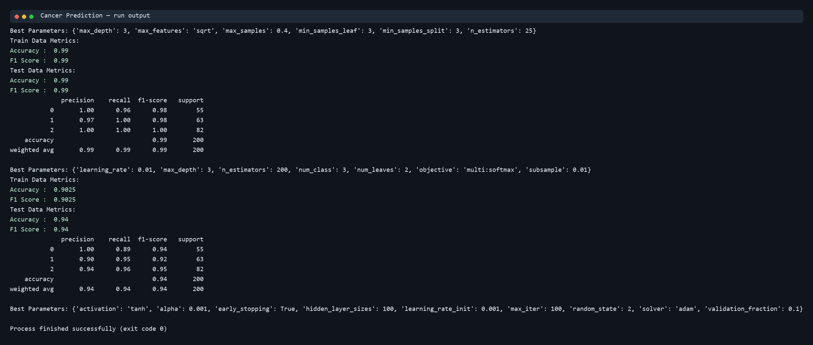

## Visualizations

The supplied plots are stored in [`figures/`](figures/).

### Age and feature distributions

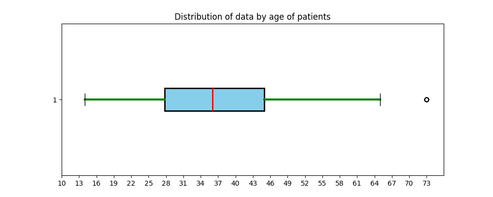

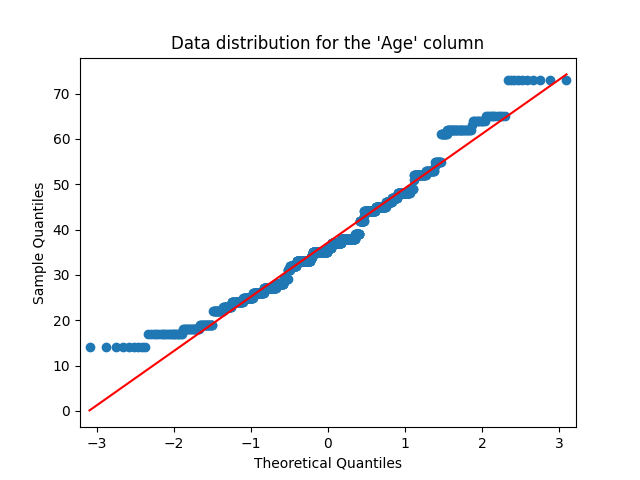

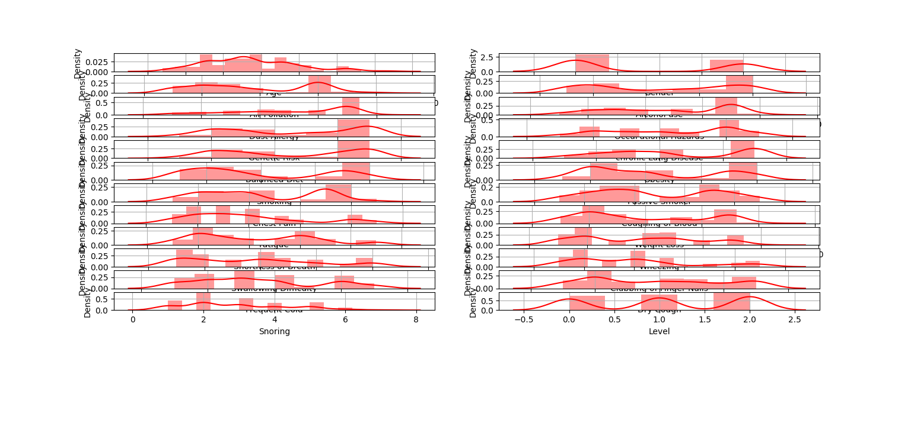

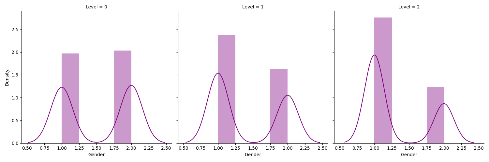

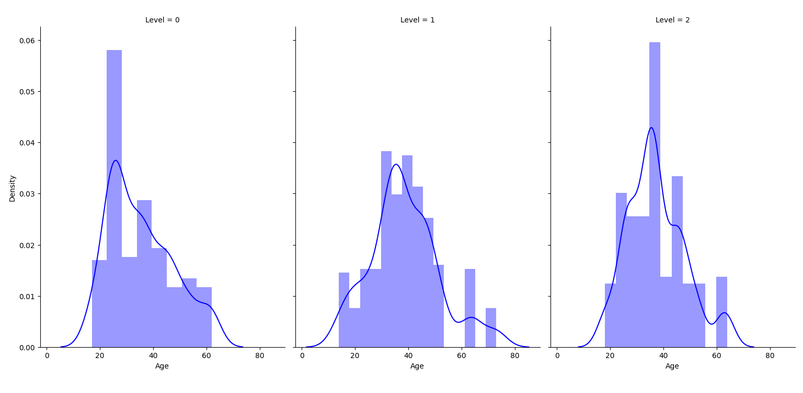

### Correlations and cancer-level balance

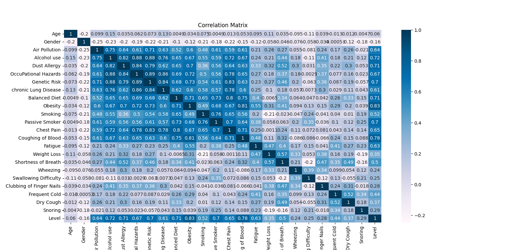


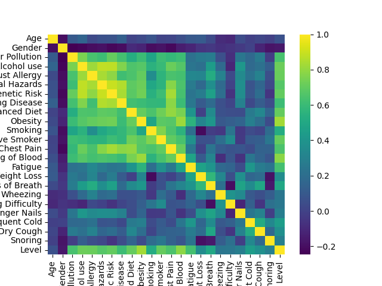

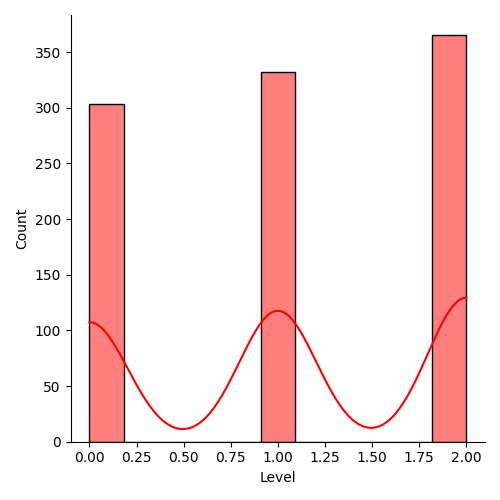

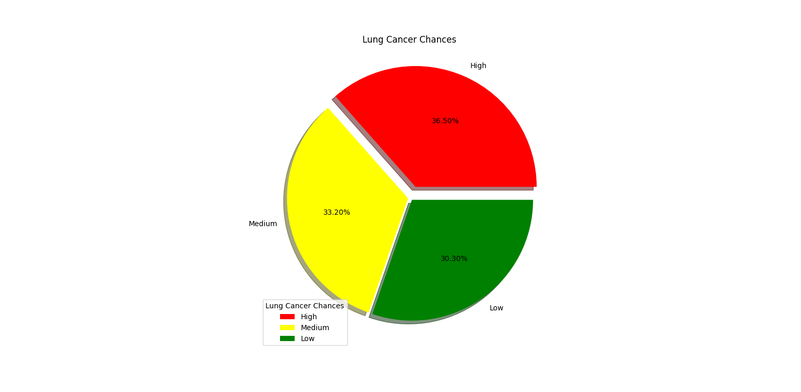

### Model results

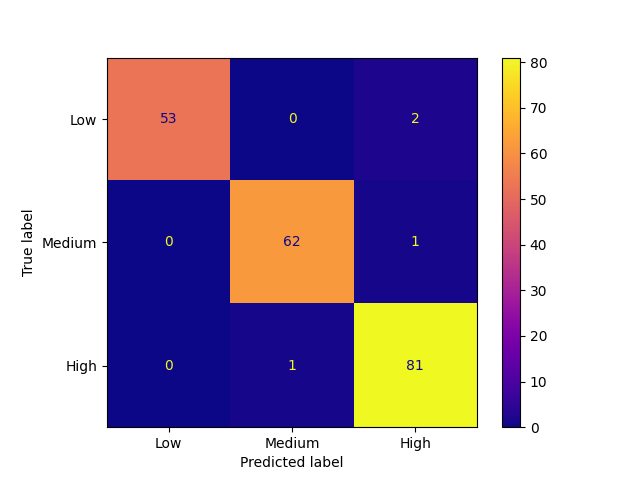


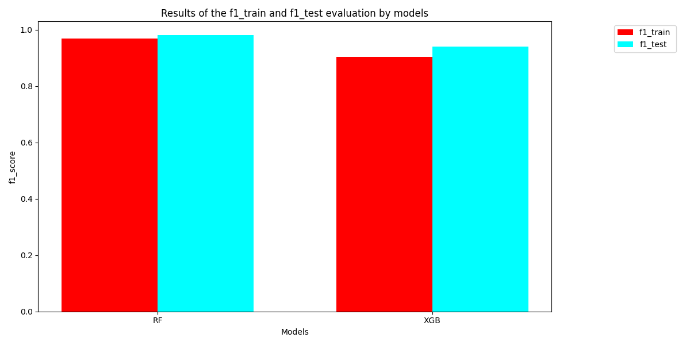

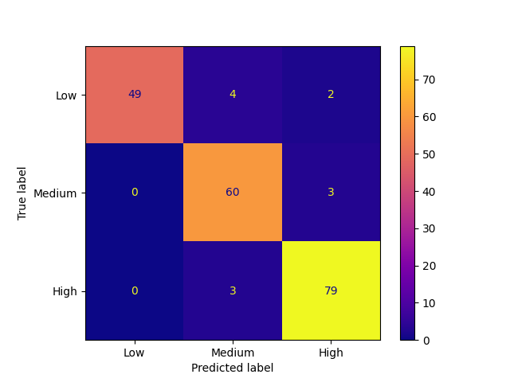

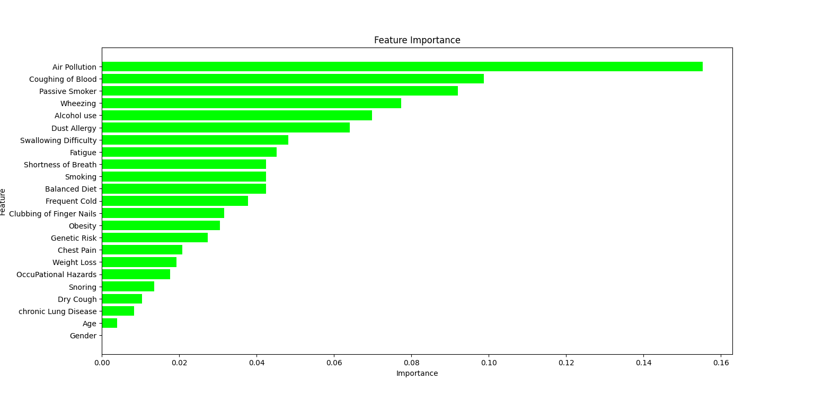
